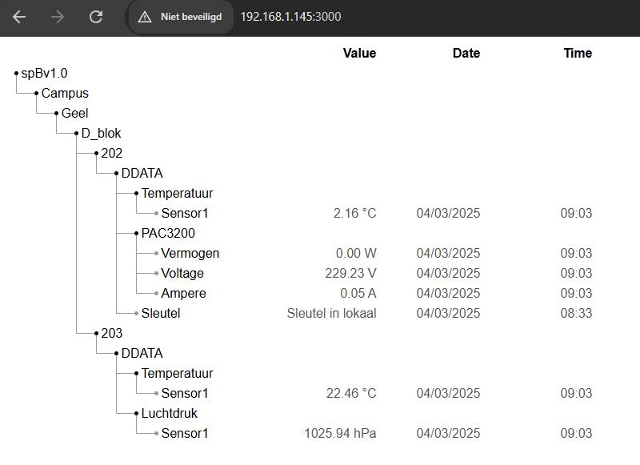
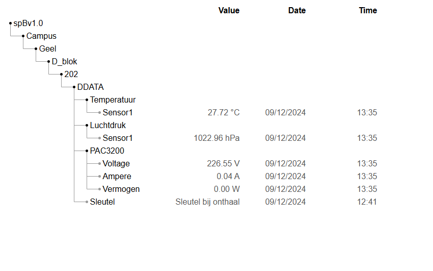

# 2425-TMScDr-002-Exploratie-van-Unified-Namespace-Concepts

## Wat is een Unified Namespace?
Een **Unified Namespace (UNS)** is een centraal georganiseerd datamodel waarin alle real-time gegevens van systemen gestructureerd en toegankelijk gemaakt worden via een hiërarchische naamgeving. Het werkt als een **single source of truth** voor alle industriële data en maakt het eenvoudiger om gegevens te delen tussen verschillende systemen, applicaties en apparaten

De data in een UNS word gepubliseerd op een manier de meteen een context geeft en de locatie toont van de gegevens, zonder dat systemen die van te voren moeten weten. Deze manier van werken biedt een **flexibele en schaalbare oplossing** voor Industriële Iot (IIoT), machine-to-machine communicatie en slimme automatisering.

Een UNS is meestal gebaseerd op MQTT en kan gebruik maken van het Sparkplug B-protocol om een consistente gegevensstructuur de garanderen. De hiërarchie binnen de namespace wordt vaak zo opgezet dat het de fysieke of functionele structuur van de organisatie weerspiegeld

### Voorbeeldstructuur van een UNS
```
Campus/Geel/D_blok/202/Sensoren/BMP280/Temperatuur
```
- Campus/Geel &rarr; Locatie
- D_block/202 &rarr; Specifiek gebouw en ruimte
- Sensorren/BMP280 &rarr; Type en identificatie van de sensor
- Temperatuur &rarr; De specifieke meting die gedaan word

Op deze manier kunnen applicaties eenvoudig nieuwe datapunten ontdekken zonder extra configuraties toe te passen, wat tijd bespaart en systeemintegratie vereenvoudigt.

## Architectuur van deze UNS
### Overzicht van de architectuur
De UNS is ontworpen als een **hiërarchische en contextgerichte gegevensstructuur**, waarin real-time sensor- en applicatiegegevens worden verzameld en gepubliseerd via MQTT en word er ook gebruik gemaakt van **Sparkplug B**. De architectuur bestaat uit volgende onderdelen:
- **Sensornodes**: zijn de fysieke aparaten zoals een BMP280 of een PAC3200.
- **MQTT-broker(HiveMQ Edge)**: Container die runnende is op de orange pi zelf voor locale dataverwerken en dat als er iets met het internet gebeurt de gegevens nog steeds lokaal bewaard worden.
- **MQTT-Clients**: De Python-client publiceert data naar de UNS, terwijl er een dashboard word gebruik om de gegevens te tonen. Er is geprobeert geweest om het modbus apparaat rechtstreeks aan de container te verbinden met behulpt van de protocol adapters die aanwezig zijn in de HiveMQ edge container.

### Structuur van de UNS
```
spBv1.0/Campus/Geel/D_blok/202/DDATA
```
Hier ziet u de base topic die gebruikt word om gegevens te versturen. Hier worden dan het type sensor en het id van de sensor aan toegevoegd om dan de gegevens te versturen.

De volledige structuur die gebruikt word bij het verzenden van bijvoorbeeld de temperatuur zal er zo uitzien
```
spBv1.0/Campus/Geel/D_blok/202/DDATA/Temperatuur/Sensor1
```

### Datastroom en communicatie

#### Sensorlaag
- De **BMP280** meet de temperatuur en de luchtdruk via **I²C**.
- De **PAC3200** meet de spanning, stroom en vermogen via **Modbus TCP**.
- Een **Discord-bot** controleert op gebruikte commands en verstuurt dan een specifiek mqtt signaal naar de UNS.
#### Verwerkingslaag (Edge Processing)
- Een **Python-script** verzamelt alle sensorgegevens en verwerkt deze in een **Sparkplub B payload**.
- **Modbus registers** worden uitgelezen en omgerekent naar leesbare waarden.
- Er word gebruik gemaakt van **Quality of Service (QoS) en Timestamping**
#### Publicatielaag
- De **Python MQTT-client** publiceert de payloads naar de juiste **UNS-topics** op de **lokale HiveMQ Edge-container**.
-De **HiveMQ Edge-container** fungeert als een **tussenlaag** en stuurt de berichten door naar de **HiveMQ Cloud**.
-Andere apparaten of systemen kunnen zich **abonneren op de cloudtopics** en de gegevens ophalen.
#### Visualisatielaag
- Een webapplicatie met **D3.js en MQTT.js** abboneert op de UNS-data en visualiseerd deze real-time.
- De **Discord-bot** stuurt berichten of de sleutel in D202 aanwezig is of niet, die in de UNS worden weergegeven en ook op het dashboard te zien zijn.


### Technologieën en protocollen
Om de architectuur van de UNS efficiënt en schaalbaar te maken, zijn de volgende technologieën en protocollen gebruikt:
- **MQTT + Sparkplug B**: voor real-time, gestandarisserde gegevensoverdracht.
- **Modbus TCP**: voor de Siemens PAC3200 uit te lezen.
- **I²C**: voor communicatie met de MBP280-sensor.
- **Python (Paho MQTT, pymodbus, smbus2, Discord)**: voor het uitlezen en verzenden van data en het aanmaken van de discord bot.
- **D3.js + MQTT.js**: voor visualisatie van de UNS in een webdashboard.
- **Docker**: voor het aanmaken van de lokale HiveMQ-edge container.


## Implementatie
### Hoe opzetten van UNS
Om de UNS op te stellen is er als eerste simpelweg gewoon statische gegevens verzonden geweest naar de cloud en ervoor gezorgt dat deze op de correcte manier verzonden werden en ook een logische en correcte structuur bevatten.

Vervolgens zijn deze statische gegevens dan vervangen geweest door simpele data van sensoren zoals de BMP280 voor de temperatuur en de luchtdruk uit te lezen. Ook is er dan uitgebreid geweest door een Siemens PAC3200 toe te voegen als ook een nieuwe orange pi die gegevens uitleest en ook verzend naar de cloud maar onder een andere structuur (naar `Campus/Geel/D_blok/203/Sensoren/BMP280/Temperatuur` in plaats van `Campus/Geel/D_blok/202/Sensoren/BMP280/Temperatuur`). Als beide van deze apparaten geïmplementeerd waren in de UNS is er een dashboard ontworpen met D3.js en MQTT.js die de hiërarchische structuur van de UNS weergeeft.

Dan als laatste aangezien een UNS niet elke sensor gegevens verzameld is er nog een discord bot gemaakt geweest die dan ook geïmplementeerd is in de UNS om aan te geven dat een UNS ook gegevens verzameld van bijvoorbeeld andere applicaties binnen de organisatie.

## Beveiliging
Op de cloud zijn er speciale credentials aangemaakt die gekent moeten zijn voordat een apparaat of software gegevens kan publiceren of ophalen naar de UNS. In de HiveMQ-edge container is er een bridge opgesteld tussen de container zelf en de Cloud, de credentials worden hierin op een veilige manier bewaart waardoor er vrij eenvoudig een verbinding gemaakt kan worden tussen de orange pi en de cloud.

## Conclusie en Verbeterpunten
De huidige opstelling werkt en doet wat een unified namespace zou moeten doen, een verbeterpunt is wel dat het Modbus apparaat rechtstreeks verbinding zou kunnen maken met de HiveMQ-Edge container op de orange pi met behulp van die protocol adapters die aanwezig zijn in HiveMQ-Edge.

## Visueel voorbeeld



# Gebruikte code + uitleg
## Code op orange pi 1 (Uitlezen sensoren)
In de repository onder `OrangePi1/DiscordBot` vind u het bestand `ReconnectTest.py`, dit is het bestand dat automatisch opgestart zal worden zodra de Orange Pi is opgestart en internet verbindng heeft. Dit bestand bevat de code voor het uitlezen van de sensoren en het doorsturen van de gegevens maar ook de code voor het opzetten van de Discord Bot die dan ook gegevens met MQTT naar de cloud kan sturen.

```
import os
import wiringpi
import discord
from discord.ext import commands
from dotenv import load_dotenv
import time
import struct
import random
import math
from sparkplug_b_pb2 import Payload, DataType
import paho.mqtt.client as mqtt
from bmp280 import BMP280
from smbus2 import SMBus
from pymodbus.client import ModbusTcpClient

# Load environment variables
load_dotenv()
TOKEN = os.getenv('DISCORD_TOKEN')
GUILD = os.getenv('DISCORD_GUILD')

BROKER = "localhost"
PORT = 1883
BASE_TOPIC = "spBv1.0/Campus/Geel/D_blok/202/DDATA"

HOST = "192.168.137.3"
PORT_MODBUS = 502
VOLTAGE_REGISTER = 1
CURRENT_REGISTER = 13
POWER_REGISTER = 25

# Discord bot setup
intents = discord.Intents.default()
intents.message_content = True
client = commands.Bot(command_prefix="/", intents=intents)

# MQTT client setup
mqtt_client = mqtt.Client(callback_api_version=mqtt.CallbackAPIVersion.VERSION1)

# MQTT connect callback function
def on_connect(client, userdata, flags, rc):
    if rc == 0:
        print("Connected to MQTT broker successfully!")
    else:
        print(f"Failed to connect to MQTT broker. Return code {rc}")

# MQTT disconnect callback function with reconnect logic
def on_disconnect(client, userdata, rc):
    #print(f"Disconnected from MQTT broker with code {rc}")
    if rc != 0:
        #print("Reconnecting to MQTT broker...")
        while not client.is_connected():
            try:
                client.connect(BROKER, PORT, 60)
                client.loop_start()
                #print("Reconnected to MQTT broker.")
            except Exception as e:
                #print(f"Reconnection attempt failed: {e}")
                time.sleep(5)

mqtt_client.on_connect = on_connect
mqtt_client.on_disconnect = on_disconnect

mqtt_client.connect(BROKER, PORT, 60)
mqtt_client.loop_start()

# BMP280 setup
bus = SMBus(0)
address = 0x76
bmp280 = BMP280(i2c_addr=address, i2c_dev=bus)

# Modbus client setup
modbus_client = ModbusTcpClient(HOST, port=PORT_MODBUS)
if not modbus_client.connect():
    print("Kon geen verbinding maken met PAC3200.")
    modbus_client = None

devices = [
    {"nodeID": "Temperatuur", "deviceID": "Sensor1", "sensor": "temperatuur", "unit": "\u00b0C"},
    {"nodeID": "PAC3200", "deviceID": "Voltage", "sensor": "spanning", "unit": "V"},
    {"nodeID": "PAC3200", "deviceID": "Ampere", "sensor": "stroom", "unit": "A"},
    {"nodeID": "PAC3200", "deviceID": "Vermogen", "sensor": "vermogen", "unit": "W"}
]

pin_CS_adc = 16  # CE pin for ADC
wiringpi.wiringPiSetup()
wiringpi.pinMode(pin_CS_adc, wiringpi.OUTPUT)
wiringpi.digitalWrite(pin_CS_adc, 1)  # Default to high (deactivated)

if wiringpi.wiringPiSPISetupMode(1, 0, 500000, 0) < 0:
    print("SPI setup failed!")
    exit(1)


def activate_adc():
    wiringpi.digitalWrite(pin_CS_adc, 0)  # Activate ADC using CS
    time.sleep(0.000005)

def deactivate_adc():
    wiringpi.digitalWrite(pin_CS_adc, 1)  # Deactivate ADC using CS
    time.sleep(0.000005)

def read_adc(channel):
    if not (0 <= channel <= 7):
        return -1
    revlen, recv_data = wiringpi.wiringPiSPIDataRW(1, bytes([1, (8 + channel) << 4, 0]))
    if revlen != 3:  # Check if we received the correct number of bytes
        return -1
    time.sleep(0.000005)
    return ((recv_data[1] & 3) << 8) + recv_data[2]


def read_float(client, register):
    try:
        response = client.read_holding_registers(register, count=2, slave=1)
        if response and not response.isError():
            raw = response.registers
            return struct.unpack('>f', struct.pack('>HH', raw[0], raw[1]))[0]
    except Exception as e:
        print(f"Uitzondering bij uitlezen register {register}: {e}")
    return None

def create_payload(device, modbus_client=None):
    payload = Payload()
    metric = payload.metrics.add()
    metric.name = device["sensor"]
    metric.alias = 1
    metric.timestamp = int(time.time() * 1000)

    if device["sensor"] == "temperatuur":
        metric.datatype = DataType.String
        try:
            activate_adc()
            adc_value = read_adc(0)  # Read channel 0
            deactivate_adc()

            if adc_value >= 0:
                # Convert ADC value to temperature (assuming 3.3V reference and LM35)
                temperature = (adc_value * 3.3 * 10) / 1023
                print(f"Temperature: {temperature:.2f} °C")
            else:
                print("Failed to read ADC value.")
        
        except Exception as e:
            temperature = 0.00
        metric.string_value = f"{temperature} {device['unit']}"
    elif modbus_client and device["sensor"] in ["spanning", "stroom", "vermogen"]:
        metric.datatype = DataType.String
        register_map = {
            "spanning": VOLTAGE_REGISTER,
            "stroom": CURRENT_REGISTER,
            "vermogen": POWER_REGISTER
        }
        value = read_float(modbus_client, register_map[device["sensor"]])

        if value is None or math.isnan(value):
            value = 0.00

        metric.string_value = f"{value:.2f} {device['unit']}"
    return payload

@client.event
async def on_ready():
    print('The bot is now ready for use!')
    print('-----------------------------')
    await client.tree.sync()

@client.tree.command(name="key")
async def key(interaction: discord.Interaction, action: str):
    if interaction.channel and interaction.channel.name == 'sleutel':
        if action == "take":
            payload = Payload()
            metric = payload.metrics.add()
            metric.name = "Sleutel"
            metric.alias = 1
            metric.timestamp = int(time.time() * 1000)
            metric.datatype = DataType.String
            metric.string_value = "Sleutel in lokaal"
            serialized_payload = payload.SerializeToString()
            topic = f"{BASE_TOPIC}/Sleutel"
            mqtt_client.publish(topic, serialized_payload)
            await interaction.response.send_message("Key was taken.")
        elif action == "return":
            payload = Payload()
            metric = payload.metrics.add()
            metric.name = "Sleutel"
            metric.alias = 1
            metric.timestamp = int(time.time() * 1000)
            metric.datatype = DataType.String
            metric.string_value = "Sleutel bij onthaal"
            serialized_payload = payload.SerializeToString()
            topic = f"{BASE_TOPIC}/Sleutel"
            mqtt_client.publish(topic, serialized_payload)
            await interaction.response.send_message("Key was returned.")
        else:
            await interaction.response.send_message("Invalid action!")
    else:
        await interaction.response.send_message(f"This command can only be used in the sleutel channel.")

# Publish sensor data in a loop
def publish_sensor_data():
    try:
        while True:
            for device in devices:
                payload = create_payload(device, modbus_client)
                topic = f"{BASE_TOPIC}/{device['nodeID']}/{device['deviceID']}"
                serialized_payload = payload.SerializeToString()
                mqtt_client.publish(topic, serialized_payload)
                print(f"Published to {topic}: {payload}")
            time.sleep(1)
    finally:
        if modbus_client:
            modbus_client.close()

# Run the Discord bot and data publishing concurrently
import threading

data_thread = threading.Thread(target=publish_sensor_data, daemon=True)
data_thread.start()

client.run(TOKEN)
```

Helemaal bovenaan de code ziet u alle nodige variabele staan die nodig zijn voor de verbinding met de cloud en de container die lokaal op de orange pi runt. Dan vervolgens in de array devices worden alle devices bewaarde die aangesloten zijn op de orange pi samen met de unit waar ze bij behoren

### Functie read_float
Deze functie word gebruikt om de floating-point waarde uit het Modbus register om te zetten naar een float in Python. 

```
def read_float(client, register):
    try:
        response = client.read_holding_registers(register, count=2, slave=1)
        if response and not response.isError():
            raw = response.registers
            return struct.unpack('>f', struct.pack('>HH', raw[0], raw[1]))[0]
    except Exception as e:
        print(f"Uitzondering bij uitlezen register {register}: {e}")
    return None
```

### Functie create_payload
Deze functie maakt een Sparkplug B payload aan voor een sensor, afhankelijk van het type sensor dat word oorgegeven in de device-parameter. Als het payload object klaar is word dit geretourneerd zodat dit naar de cloud verzonden kan worden
```
def create_payload(device, modbus_client=None):
    payload = Payload()
    metric = payload.metrics.add()
    metric.name = device["sensor"]
    metric.alias = 1
    metric.timestamp = int(time.time() * 1000)

    if device["sensor"] == "temperatuur":
        metric.datatype = DataType.String
        try:
            activate_adc()
            adc_value = read_adc(0)  # Read channel 0
            deactivate_adc()

            if adc_value >= 0:
                # Convert ADC value to temperature (assuming 3.3V reference and LM35)
                temperature = (adc_value * 3.3 * 10) / 1023
                print(f"Temperature: {temperature:.2f} °C")
            else:
                print("Failed to read ADC value.")
        
        except Exception as e:
            temperature = 0.00
        metric.string_value = f"{temperature} {device['unit']}"
    elif modbus_client and device["sensor"] in ["spanning", "stroom", "vermogen"]:
        metric.datatype = DataType.String
        register_map = {
            "spanning": VOLTAGE_REGISTER,
            "stroom": CURRENT_REGISTER,
            "vermogen": POWER_REGISTER
        }
        value = read_float(modbus_client, register_map[device["sensor"]])

        if value is None or math.isnan(value):
            value = 0.00

        metric.string_value = f"{value:.2f} {device['unit']}"
    return payload
```

### Verzenden van de payload
In dit deel word er continu door de devices array geloopt om zo continu de gegevens te kunnen ophalen om dan naar de container te verzenden. Met `payload.SerializeToString()` word het Payload-object naar een binaire stringrepresentatie omgezet, dit betekend dus ook dat als de gegevens opgehaald worden ze opnieuw gedeserialiseerd moeten worden naar een leesbaar formaat.
```
def publish_sensor_data():
    try:
        while True:
            for device in devices:
                payload = create_payload(device, modbus_client)
                topic = f"{BASE_TOPIC}/{device['nodeID']}/{device['deviceID']}"
                serialized_payload = payload.SerializeToString()
                mqtt_client.publish(topic, serialized_payload)
                print(f"Published to {topic}: {payload}")
            time.sleep(1)
    finally:
        if modbus_client:
            modbus_client.close()
```

### Discord bot functionaliteit
In dit deel word de discord bot opgezet en commands toegevoegd zodat de bot weet wat die moet doen bij het gebruik van de commandos's. Er word een command gemaakt `/key` met 2 sub niveaus `take` en `return`. Bij gebruik van het commando `/key take` word er een signaal verstuurt naar het topic dat eindigt op **/Sleutel** met de tekst _Sleutel in lokaal_ . Bij gebruik van het commando `/key return` word er een signaal verstuurt naar het topic dat eindigt op **/Sleutel** met de tekst _Sleutel bij onthaal_.
```
@client.event
async def on_ready():
    print('The bot is now ready for use!')
    print('-----------------------------')
    await client.tree.sync()

@client.tree.command(name="key")
async def key(interaction: discord.Interaction, action: str):
    if interaction.channel and interaction.channel.name == 'sleutel':
        if action == "take":
            payload = Payload()
            metric = payload.metrics.add()
            metric.name = "Sleutel"
            metric.alias = 1
            metric.timestamp = int(time.time() * 1000)
            metric.datatype = DataType.String
            metric.string_value = "Sleutel in lokaal"
            serialized_payload = payload.SerializeToString()
            topic = f"{BASE_TOPIC}/Sleutel"
            mqtt_client.publish(topic, serialized_payload)
            await interaction.response.send_message("Key was taken.")
        elif action == "return":
            payload = Payload()
            metric = payload.metrics.add()
            metric.name = "Sleutel"
            metric.alias = 1
            metric.timestamp = int(time.time() * 1000)
            metric.datatype = DataType.String
            metric.string_value = "Sleutel bij onthaal"
            serialized_payload = payload.SerializeToString()
            topic = f"{BASE_TOPIC}/Sleutel"
            mqtt_client.publish(topic, serialized_payload)
            await interaction.response.send_message("Key was returned.")
        else:
            await interaction.response.send_message("Invalid action!")
    else:
        await interaction.response.send_message(f"This command can only be used in the sleutel channel.")
```

### Thread starten voor publishen van data
Hierbij word er een thread gestart om ervoor te zorgen dat de discordBot en het publishen van de data gelijktijdig kan gebeuren
```
import threading

data_thread = threading.Thread(target=publish_sensor_data, daemon=True)
data_thread.start()

client.run(TOKEN)
```


## Code op orange pi 2

## Code op orange pi 1 (Uitlezen sensoren)
In de repository onder `OrangePi2` vind u het bestand `readSensorSparkplug.py`, dit is het bestand dat automatisch opgestart zal worden zodra de Orange Pi is opgestart en bevat de code voor het uitlezen van de sensoren en het doorsturen van de gegevens.
Deze code is zo goed als identiek aan de code die gebruikt is geweest voor de OrangePi1, enige verschil is dat er voor het uitlezen van de temperatuur er hier een andere sensor gebruikt is geweest.

```
import time
import random
from sparkplug_b_pb2 import Payload, DataType
import paho.mqtt.client as mqtt
from bmp280 import BMP280
from smbus2 import SMBus

BROKER = "localhost"
PORT = 1883
BASE_TOPIC = "spBv1.0/Campus/Geel/D_blok/203/DDATA"

#Instellen van BMP280
bus = SMBus(0)
address = 0x76
bmp280 = BMP280(i2c_addr=address, i2c_dev=bus)

devices = [
    {"nodeID": "Temperatuur", "deviceID": "Sensor1", "sensor": "temperatuur", "unit": "°C"},
    {"nodeID": "Luchtdruk", "deviceID": "Sensor1", "sensor": "luchtdruk", "unit": "hPa"}
]

#Opstellen van de payload
def create_payload(device):
    payload = Payload()
    metric = payload.metrics.add()
    metric.name = device["sensor"]
    metric.alias = 1
    metric.timestamp = int(time.time() * 1000)

    if device["sensor"] == "temperatuur":
        metric.datatype = DataType.String
        try:
            temperature = round(bmp280.get_temperature(), 2)
        except Exception as e:  # Capture and handle exceptions properly
            temperature = 0.00
        metric.string_value = f"{temperature} {device['unit']}"
    elif device["sensor"] == "luchtdruk":
        metric.datatype = DataType.String
        try:
            pressure = round(bmp280.get_pressure(), 2)
        except Exception as e:  # Fixes "expect" to "except"
            pressure = 0
        metric.string_value = f"{pressure} {device['unit']}"

    return payload


#Verbinding maken met de hivemq edge container
client = mqtt.Client(callback_api_version=mqtt.CallbackAPIVersion.VERSION1)
client.connect(BROKER, PORT, 60)

while True:
    #Doorheen opgegeven devices heen gaan en payload opsturen
    for device in devices:
        payload = create_payload(device)
        topic = f"{BASE_TOPIC}/{device['nodeID']}/{device['deviceID']}"
        
        serialized_payload = payload.SerializeToString()
        client.publish(topic, serialized_payload)
        print(f"Published to {topic}: {payload}")
    time.sleep(1)
 ```

### Functie create_payload
In dit deel van de code word een BMP280 sensor gebruikt om de temperatuur en luchtdruk te verkrijgen. Omdat er hierbij gebruik word gemaakt van een BMP280 is er geen nood aan het aanspreken van een andere functie voor een AD-Converter en kunnen we gewoon met behulp van bmp280.get_temperature() de temperatuur verkijgen.
```
#Opstellen van de payload
def create_payload(device):
    payload = Payload()
    metric = payload.metrics.add()
    metric.name = device["sensor"]
    metric.alias = 1
    metric.timestamp = int(time.time() * 1000)

    if device["sensor"] == "temperatuur":
        metric.datatype = DataType.String
        try:
            temperature = round(bmp280.get_temperature(), 2)
        except Exception as e:  # Capture and handle exceptions properly
            temperature = 0.00
        metric.string_value = f"{temperature} {device['unit']}"
    elif device["sensor"] == "luchtdruk":
        metric.datatype = DataType.String
        try:
            pressure = round(bmp280.get_pressure(), 2)
        except Exception as e:  # Fixes "expect" to "except"
            pressure = 0
        metric.string_value = f"{pressure} {device['unit']}"

    return payload
```


## Dashboard
Het dashboard word bewaard als container op Orange pi 1, de docker container zal ook automatisch opstarten als de orange pi opstart. Als er dan naar het ip address van de orange pi word gegaan via poort 3000 zal je het dashboard kunnen zien.

